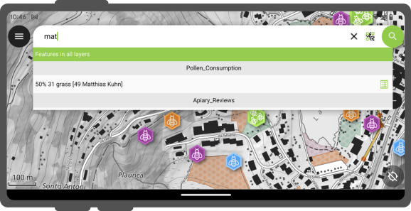
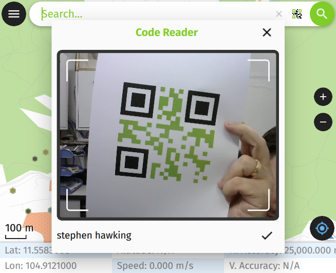
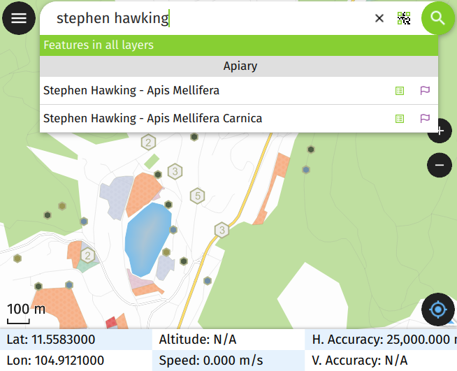

# Search bar

QField is equipped with a nifty search bar which allows you to search for
features within project's vector layers, to go to entered coordinates and more.

## Usage
:material-tablet: Fieldwork

Tap on the *Search button* in the top-right corner of the screen to
open expand the search bar.

### Vector layers search

The value entered in the search bar will be used to find features with
matching attribute values. A minimum of three characters is required to
start the search.

!

### Active Layer Search Feature Matching

The active layer search functionality enhances search efficiency by focusing exclusively on the currently active layer and specific fields within it.

To start a search, simply type `f` followed by your search term. This helps you quickly find items by searching only the active layer. It scans feature names and all text and number fields for matches. When it finds one, both the attribute's name and value are highlighted. You'll also see the feature's name in the search results below. To narrow down your search to a specific field, type: `f @ATTRIBUTE_NAME search-term`. This targets your search to that field.

### Search with code scanner

Additionally, you have the option to employ the code scan functionality for this purpose.

When click on the "Scan code" will trigger QField's code reader, initiating the scanning process to decode the code.

!

Once you are content with the scanned information, you can simply click on the checkmark (✔️) OK button to initiate a search for that specific string(In this example, the code corresponds to a user identifier that is associated with various features in a project dataset).

!

For distinct outcomes, is recommend encoding your feature UUIDs. This will allow us to promptly locate the relevant items.

Matching features will show in the results list offering you two possible
actions :

1.  Tap on the *name* in the result to pan the map on the feature (the
    feature will be highlighted in yellow).
2.  Tap on the *attributes button* to open its attributes.

### Search with NFC

In addition, the Code Reader offers the capability to read NFC text tags.

!

!!! note
    While both the QR code camera and the NFC text tag detector are enabled by default when you open the Code Reader. You have the flexibility to disable either of these features to ensure that your device's battery is not used unnecessarily to activate hardware that you may not need at the moment.

### Go to coordinate

It is possible to go to a given coordinates through the search bar by entering
*latitude, longitude* coordinates (in WGS84). You will also be able to enter
coordinates in the CRS of the opened project.

Once QField identifies the entered value as a coordinate, tap on the *coordinates*
in the result to move the map canvas to that point.

### Go to spatial bookmark

The search bar also matches saved spatial bookmarks. The entered text will be
matched against user-saved bookmarks as well as embedded bookmarks with the
currently opened project.

The matching bookmarks will appear in the results list. Tapping on one bookmark
will re-center the map canvas to match the bookmark's extent.

### Expression calculator

QField's search bar also acts as a nifty calculator, whereas entered text can be
treated as expressions, with their returned value shown in the result list
with the possibility of copying the value to the clipboard.

To trigger the calculator, a *= * (i.e. equal sign followed by a space) prefix is
needed. For example, *= 20 + 5* would return a value of 25.

Pro-tip: use the aggregate() expression function to calculate statistics against
vector layers. For example, calculating the total area covered by a polygon layers
can be done by typing *= aggregate('my_layer','sum', $area)*.

## Configure vector layers search in QGIS
:material-monitor: Desktop preparation

By default, all vector layers are searchable. When configuring your project in QGIS,
it is possible to exclude vector layers from search results. To do so, open the
project properties dialog and switch to the *Data Sources* panel, where you will
be presented with a layers capabilities table widget. From there, use the *Searchable*
checkbox to include/exclude specific layers.
