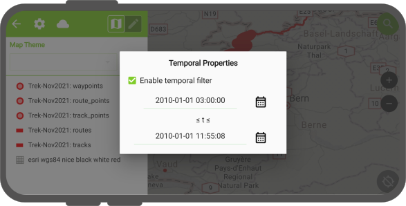
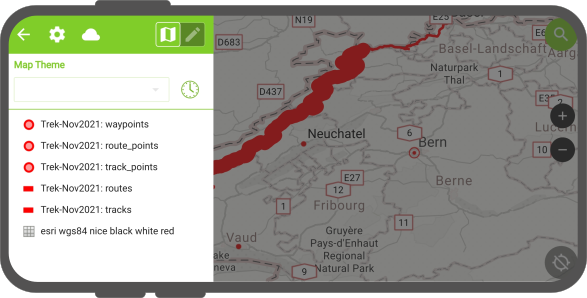

# Temporal filtering

When QField consumes projects containing one or more layers with active temporal settings, a temporal filtering indicator located within the side dashboard appears next to the map theme combo box. A green clock icon indicates temporal properties are filtering features drawn on the map canvas is active, while a gray clock icon indicates the filtering is turned off.

!

## Adjusting temporal filtering

When clicking on the side dashboard's temporal filtering indicator, a temporal properties panel pops up. From there, you can enable the temporal filter and set the temporal range's beginning and end time. 

!

QField's temporal filtering behaves exactly like the fixed range temporal navigation mode in QGIS.

!!! note
    Beginning with version 2.2, QField will automatically setup and enable temporal settings for individual vector datasets when a temporal field is detected. This can come in handy when consuming GPS datasets.
