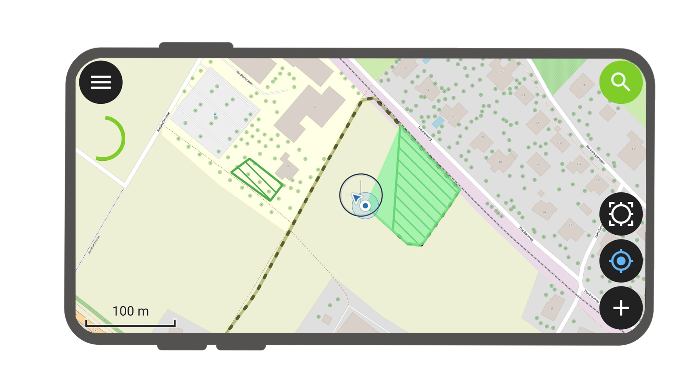
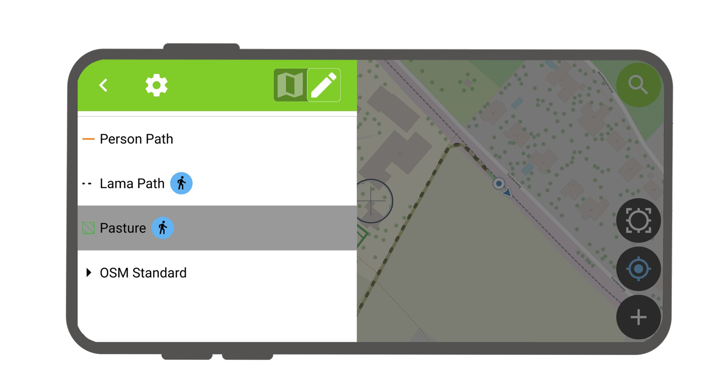
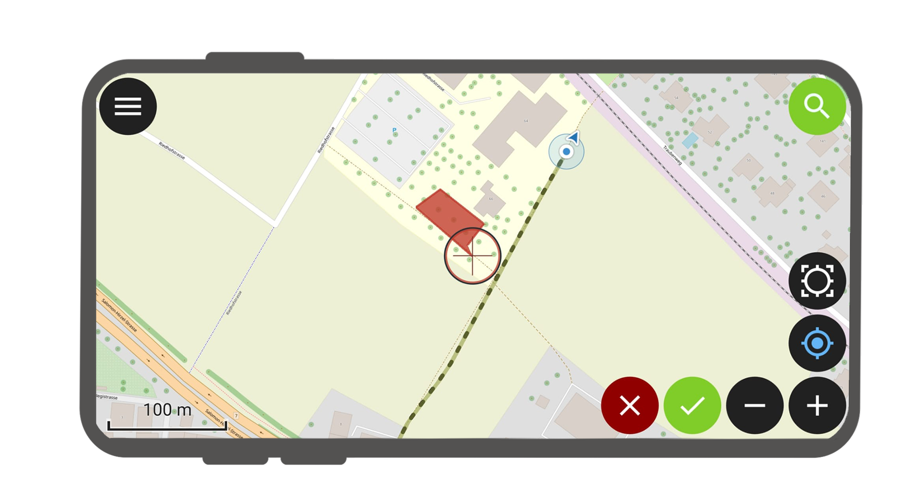

# Tracking

You have the possibility to do tracking on lines and polygons in QField.

## Usage
:material-tablet-android:{ .device-icon } Fieldwork

It's available when GNSS is enabled. A tracking session can be started
in the legend by long-pressing on the layer. The time interval and the
minimum distance can be entered individually to define when a vertex
needs to be set.

There can be several trackings session active on several layers. But
only one tracking session per layer can be active at the time.

!

!

The tracked feature is saved on every vertex. While the tracking session
is active the layer is still editable, but the tracked feature can't be
edited or deleted until the tracking session is stopped over the legend
again.

!

If the layer geometry supports m value, the time is stored in the m
value, that passed since the first vertex of this tracking session has
been recorded.
