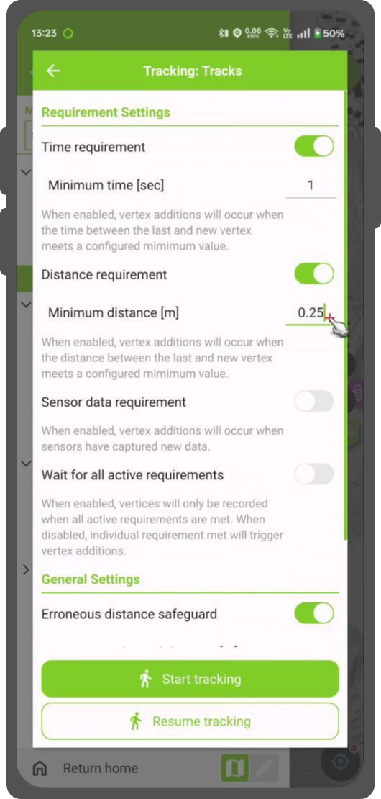

# Tracking

QField allows you to create points, lines, and polygons from tracking your position.

## Activate tracking

:material-tablet: Fieldwork

To activate tracking, you must first make sure the positioning is active. Then,
open the side "Dashboard", long-press on a legend layer within which you want to
save your tracks to, and select the *Setup tracking* button to configure
the tracking session.

!

Two constraints are available to limit the number of vertices recorded
during tracking:

- A minimum time interval
- A minimum distance

!

Once you have finished configuring your tracking session, hit the *Start tracking*
button to begin recording. At this stage, a feature form will appear, which allows
you to define the attributes of the feature(s) that will be created while QField
tracks your position.

For line and polygon layers, a single feature - its geometry formed of vertices
from the recorded positions - will be create per tracking session.  For point
layers, a feature will be created for each recorded position, with attribute
values entered in the form remembered across features.

To prevent overlapping, you have the option to set a maximum distance tolerance between the last and next tracked point/vertices.
This ensures that if the position exceeds this defined distance, it is considered as an erroneous entry.

!!! note
    QField will skip the feature form step if the layer is configured to hide all attributes or if form has been set to hide on feature addition in the attribute form settings.
    This can streamline the process of starting tracking sessions.

!!! note
    QField offers the capability to resume tracking sessions seamlessly, even if the application has been restarted or the device has been rebooted.
    This ensures continuity by allowing previously started tracking sessions to be reactivated without loss progress.

!

## Tracking underway

Once a tracking session has been setup, a badge will appear in the side "Dashboard"
legend next to the layer(s) against which tracking is being recorded.

!

The features created by the tracking session are saved on every vertex recorded.
A rubber band line overlaid onto the map is attached to each tracking session,
allowing you to glance at what has been recorded.

If the layer linked to a tracking session supports the M dimension, QField will store
the time passed since the first vertex recorded in each vertex's M value.

!!! note
    You can simultaneously record multiple trackings sessions across several layers.

!!! note
    While the tracking session is active the layer is still editable, but the tracked feature can't be edited or deleted until the tracking session is stopped over the legend again.

## Terminate tracking

To terminate tracking, simply open the side "Dashboard". From there, long-press
on a legend layer linked to an active tracking session and select the
*Stop tracking* button.

!

## Predefined Project Tracking Sessions

This functionality enables one or more position tracking sessions to automatically start upon project load.
Users will be presented with a feature form popup as the tracking session begins to fill in attributes.
If the vector layer used to track has the "Hide Form on Add Feature" mode selected, the feature form will be skipped.

!

### Configure a Project Tracking Session
:material-monitor: Desktop preparation

You can configure a tracking session in QGIS.
Open and direct to *Layer Properties* > *QField*.
There, you can activate "Tracking Session" and specify the tracking requirements.
Note that the QField panel is only available when the QFieldSync plugin is installed in your QGIS profile.

!

!

!!! note
    ### Benefits
    - **Efficiency**: Automation saves time and effort in the field.
    - **Flexibility**: Users can customize sessions and opt for automatic initiation with default values.
