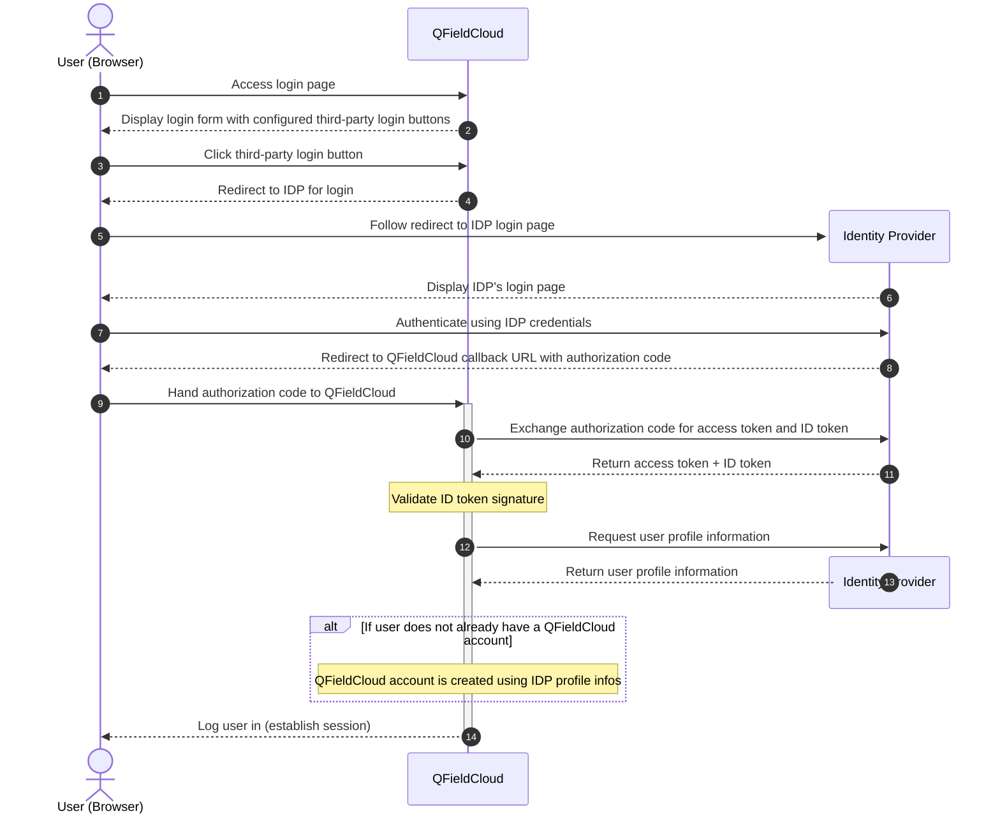
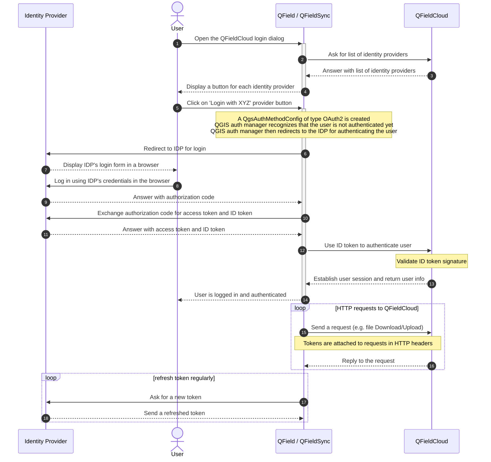

# Authentication

QFieldCloud and QField / QFieldSync clients allow authentication using regular username and password, or, if configured, **OpenID Connect** with a third-party identity provider.

## OpenID Connect authentication

[OpenID Connect](https://openid.net/developers/how-connect-works/) (OIDC) is an industry standard authentication protocol on top of [OAuth2](https://oauth.net/2/) that allows to delegate authentication to an identity provider (IDP) such as Google, Microsoft, or any other OpenID Connect compliant provider. This allows users to log in to QFieldCloud using their existing accounts with these providers, without needing to create a separate account for QFieldCloud.

OIDC can be used directly for signing up with QFieldCloud, or for signing in to an existing QFieldCloud account (matched via verified email address).

### QFieldCloud (Web)

Here is a sequence diagram of how a third-party login happens in QFieldCloud (in the browser):

### QField / QFieldSync

Here is a sequence diagram of how third-party authentication happens in QField and QFieldSync:

#### Details

1. **Open the QFieldCloud login dialog**
   User clicks on the QFieldCloud login button in QField / QFieldSync  

2. **Ask for list of identity providers**
   Query the QFieldCloud `api/v1/auth/providers` endpoint for a list of enabled identity providers, and their configuration details.  

3. **Answer with list of identity providers**
   Return the list of enabled identity providers.
   For each IDP this will include information to render the UI (title, logo, colors), and also the necessary OIDC configuration details for the given IDP. These include properties like the client ID, token URL, etc. for QField/QFieldSync to connect to the IDP.  

4. **Display a button for each identity provider**
   For each enabled authentication method a login button is rendered.  

5. **Click on 'Login with XYZ' provider button**
   User clicks the button to log in with a particular provider.
   At this point, QField/QFieldSync will create a new `QgsAuthMethodConfig` of type OAuth2, and will use the OIDC configuration details received from QFieldCloud to configure it.  

6. **Redirect to IDP for login**
   QField/QFieldSync will then open a browser window and send the user to the IDPs login page.
   In the URL for that login page a redirect_url is included which points back to the callback at which QField/QFieldSync will receive the IDP's response that will include the authorization code.
   For that purpose, QField/QFieldSync will spawn a temporary web server at `http://localhost:7070` which will receive that callback.  

7. **Display IDP's login form in a browser**
   The IDP presents the user with a login page and a consent form.  

8. **Log in using IDP's credentials in the browser**
   The user authenticates to the IDP, using whichever authentication method the IDP supports (username/password, client certificate, session, ...).  

9. **Answer with authorization code**
   The IDP will redirect the user's browser back to the redirect_url, where QField/QFieldSync's temporary webserver will receive the callback, which includes the long lived OIDC authorization code.  

10. **Exchange authorization code for access token and ID token**
   QField/QFieldSync will send the authorization code to the IDP's token endpoint, and exchange it for ID token, access token and refresh token.  

11. **Answer with access token and ID token**
   The IDP verifies the authoritation code (with the addition of PKCE), and responds with ID token, access token and refresh token, which are short lived.  

12. **Use ID token to authenticate user**
   QField/QFieldSync will send the ID token and access token to QFieldCloud, and request the user's profile information.  

13. **Establish user session and return user info**
   QFieldCloud will verify the ID token's signature and authenticate the user. If successful, it responds with the user's profile information and a user session.  

14. **User is logged in and authenticated**
   QField/QFieldSync will receive and store the user's profile information and authentication session.  

#### Request loop

15. **Send a request (e.g. file Download/Upload)**
   Once a user has authenticated with the IDP, and QField/QFieldSync has received the OIDC tokens, it will attach the ID token and access token in subsequent requests to QFieldCloud as HTTP request headers.
   (Technically speaking, it's actually the QGIS auth manager which will do this).
   The access token is included as an `Authorization: Bearer <access_token>` HTTP header, and the ID token is included in the `X-QFC-ID-Token` HTTP header.
   The IDP provider type (e.g. `google`) is included in the `X-QFC-IDP-ID` HTTP header, to let QFieldCloud know which IDP the token needs to be verified with.  

16. **Reply to the request**
   QFieldCloud will authenticate the user, either through an existing session, or through the OIDC tokens, and respond to the request.  

#### Token refresh loop

17. **Ask for a new token**
   QField/QFieldSync will regularly refresh the ID and access tokens by calling the IDP's token refresh endpoint and submitting the refresh token it received.  

18. **Send a refreshed token**
   The IDP will respond with new ID and access tokens.  
