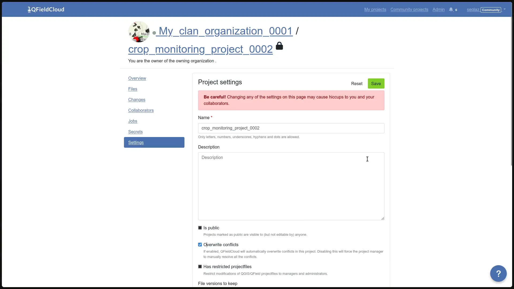

# Jobs

Jobs on QFieldCloud perform heavy operation with project files and layers within QGIS. Jobs are created in response to certain user actions.

Once a job is created, it is added to the project's job queue and waits for available QFieldCloud resources to run.
At any given moment only one job can run per project. The rest of the queued jobs will perform in the same order as in they entered the queue.

Each job consists of one or more steps and each step is responsible for one self contained task on the project.
QFieldCloud supports three predefined job workflows: `process_projectfile`, `package` and `delta_apply`.

While running, jobs are writing log messages which are available on project's jobs page for jobs that have reached a final status `FINISHED` or `FAILED`.

Jobs have access to [project secrets](projects.md#secrets).

!!! note
    All jobs can be triggered using the QFieldCloud API.

!!! warning
    - Any of the triggering conditions described on this page might change without notice.
    - All jobs must finish within 10 minutes or they will result in a timeout error and will be terminated.

!!! info
    If you are looking for technical details how Jobs work, check the [Job Queue documentation](./architecture.md#job-queue).

## Job types

### Process project file (`process_projectfile`) job

The process project file job is used to extract details about the project configuration and project layers including QGIS version used, project CRS, layer CRS, layer names, layer validity etc.
QFieldCloud validates the uploaded QGIS project file (`.qgs`/`.qgz`), as well as the supporting GeoPackages, TIFFs and other data source files.
It also validates remote connections to PostGIS, WFS, WMS and other online data sources.
QFieldCloud will open the project file in a QGIS instance on the server to extract all the necessary information.

#### Triggers and Possible Errors

This job is triggered every time a file is uploaded to QFieldCloud.

The following conditions may result in an error while uploading to QFieldCloud:

- No QGIS project file (`.qgs`/`.qgz`) has been uploaded yet.
- The uploaded file is within the `DCIM` directory.
Those files are assumed to be irrelevant to project validity.
- There is already a `process_projectfile` job in `PENDING` status.

Troubleshoot and fix
A `process_projectfile` job might result in a `FAILED` status, due to several reasons.
Below is a list (non-exhaustive) with the most common causes:

- The uploaded QGIS project file (`.qgs`/`.qgz`) is unreadable, incomplete, broken or wrong.
Try to reupload the QGIS project file.
- QGIS is crashing after opening the project file.
- Try to identify the layer that is causing the crash by removing one layer at a time from the project and reuploading the QGIS project file.

!!! note
    Even if a `process_projectfile` job results in a `SUCCESS` status, it does not mean the project is properly configured.
    The `SUCCESS` status just states the project has been successfully opened and all the needed information has been extracted.

### Package (`package`) job

The `package` job converts a QGIS project to a QField project, the same way it is done on QGIS via QFieldSync.
The `package` job will prepare all layers marked as "Offline editing" to a single GeoPackage.

#### Triggers and Possible Errors

This job is triggered every time the **Download** or **Synchronize** buttons are pressed on QField.
Unless at least one of the following condition are valid:

- The project has never run a `process_projectfile` job that resulted in `SUCCESS` status.
- There is already a `package` job in `PENDING` status.
- The project does not contain online vector layers (PostGIS, WFS etc), the latest `package` job result was `SUCCESS` and there were no file uploads, nor change uploads.

#### Troubleshoot

A `package` job might result in `FAILED` status , due to several reasons.
Below is a list (non-exhaustive) with the most common causes:

- The project has never run a `process_projectfile` job that resulted in `SUCCESS` status.
- Some of the project layers are inaccessible from QFieldCloud.
- Make sure all files are uploaded and all credentials to online layers (PostGIS, WFS etc) are stored within the QGIS project file.

### Delta apply (`delta_apply`) job

Delta apply jobs is responsible to make all pushed QField changes permanent.

#### Triggers and Possible Errors

This job is triggered every time a **Synchronize** or **Push changes** button is pressed on QField, or **Apply pending changes** button is pressed on the **Changes** project page in QFieldCloud.

Issues may arise if any of the following condition are valid:

- The project never ran a `process_projectfile` job that resulted in `SUCCESS` status.
- There is already a `delta_apply` job in `PENDING` status.

#### Troubleshoot

A `delta_apply` job may result in a `FAILED` status, due to several reasons.
Below is a list (non-exhaustive) with the most common causes:

- **Database connection issues:** The online database (PostgreSQL/PostGIS) used in the QGIS project reset the connection, timed out, or is currently unavailable.
- **Feature missing:** The feature being updated has been deleted from the source data (e.g., by another user or process) before the delta change could be applied.
- **Layer missing:** The layer corresponding to the changes was removed from the QGIS project.
- **Source changed:** The structure of the layer source was changed (e.g., columns were renamed or removed), making the delta incompatible.
- **Project size:** The project is too big and the job has failed to run within the resource limits.
- **Hidden files:** There are hidden files and directories within the project that are preventing the normal work of QFieldCloud.
    Hidden files and directories are those starting with a leading dot (`.`).

##### Understanding conflicts `delta_apply` jobs

Conflicts occur when multiple changes affect the same data in a way that QFieldCloud cannot automatically resolve without a defined policy.

**What a "CONFLICT"?**

In the **Changes** section, a delta status is set to `CONFLICT` when:

1. **Concurrent Editing:** Two or more users modify the same feature (identified by the same primary key) on the same layer.
2. **Primary Key Collision:** A new feature is created with a primary key that already exists in the database.

**What overwrites what?**

QFieldCloud resolves these conflicts based on the project's conflict resolution setting.

- **Last Wins (Default):** QFieldCloud compares the timestamps of the conflicting changes.
    The change with the most recent timestamp overwrites any previous changes to the same attributes.
    The older change is effectively discarded in favor of the newer one, though it remains in the history.
- **Manual:** No changes are overwritten automatically. The conflict is flagged, and the project administrator must manually select which version to apply.

**Preventing Conflicts**

To minimize the risk of conflicts, follow these best practices:

- **Plan updates collaboratively**: When updating features based on specific field conditions, assign each user a distinct set of features to edit.
    Clear planning reduces overlap and potential conflicts.
- **Avoid modifying primary keys**: Primary keys should be treated as immutable and configured to be read-only.
    This ensures consistent identification of features and prevents accidental modifications.
- **Ensure unique primary keys**: Use a truly unique [primary key](../../get-started/tutorials/advanced-setup-qfc.md#project-configuration-best-practices) to prevent conflicts and ensure data integrity.

By implementing these practices, you can significantly reduce the likelihood of conflicts and maintain consistent data.

###### How to resolve conflicts?

By default, QFieldCloud overwrites conflicts using a _last wins_ policy (the latest patch of changes to the attribute(s) involved in the conflict replaces all earlier patches of changes to these attributes).
Alternatively, admins can set a project's conflict resolution policy to _manual_.
Doing so will require the project manager to manually resolve conflicts, picking those to be applied to the project.

1. Navigate to the "Changes" section.
2. Filter the changes with the "CONFLICT" status.
3. For each conflicted change, select it and set the status to "Re-apply" from the "Action" dropdown menu, alternatively if all the new changes are in conflict you can choose in the last conflicted change and select "Re-apply this and newer changes".
4. Check the details of changes in the conflict and click "Save All" at the end of the page.

!

##### Re-apply changes in QFieldCloud

1. Click on the project's name under _My projects_.
2. Go to the _Changes_ section. (Changes are sorted from latest to oldest)
3. Find the specific changes you want to reapply.
4. In the _Action_ column on the right, click on the dropdown list.
5. Choose the desired action to reapply the changes.

    - Re-apply Specific Changes: If you need to reapply specific changes, select each change you want to re-apply and click __Re-apply__.
    - Re-apply Recent Changes: If you prefer to reapply the most recent modifications made to the project, identify the initial change you want to restore, then select __Re-apply this and newer changes__.

Finally, click the __Save all__ button.

!

## Troubleshoot job logs

When running a job, usually you can find a step in the logs called "Check project layers" that prints a table with all the project layers and status next to them.

The possible statuses are:

- **ok** - The layer loads correctly on QFieldCloud.
- **invalid_dataprovider** - the layer's data provider is invalid. Usually additional information is shown in the "Provider Summary".
- **invalid_layer** - This errors should happen very rarely if ever. The data is loaded correctly, but for some reason QGIS reports the layer as invalid.

### Unable to connect to service "`{SERVICE}`".

QFieldCloud tries to connect to a PostgreSQL service that is not available.
You should need to create a new pgservice [secrets](./projects.md#secrets) so QFieldCloud can connect to the PostgreSQL service.

### Unable to connect to host "`{HOST}`".

QFieldCloud cannot establish a connection to the given `{HOST}`. Your service is not accessible from the QFieldCloud server.
You might been to ask your IT department [to whitelist the QFieldCloud IP](./specs.md#firewall-configuration).

### Unable to connect to host "localhost".

You have uploaded a layer that connects to a database/service on your local machine.
Either remove that layer or replace it with a layer source accessible by QFieldCloud.

### File "`{FILENAME}`" missing.

The file `{FILENAME}` (e.g. `/tmp/rndstr/files/data.gpkg`) is not found on the QFieldCloud server and cannot be opened.
There are two things that should be checked:

- Whether the file has been uploaded to the cloud.
You can check this in *Project Settings* > *Files* page on QFieldCloud or QFieldSync.
- Making sure the file is uploaded with the same relative path as on your PC.
Please note that **all** project files should be within the same project directory or subdirectory as the `.qgs`/`.qgz` QGIS project file.
Please also note the directory names should be preserved too, for example if a file is stored in `data/data.gpkg`, make sure the `data` directory exists on QFieldCloud too.
