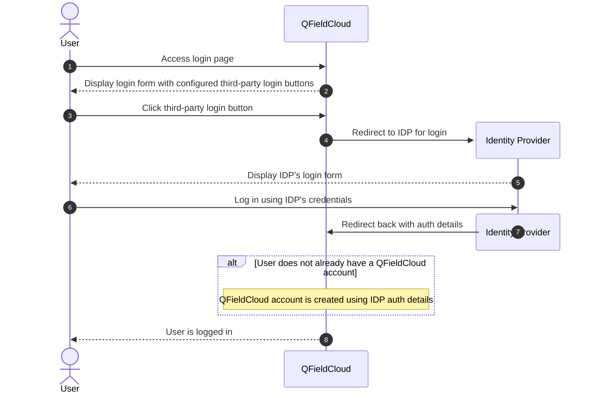
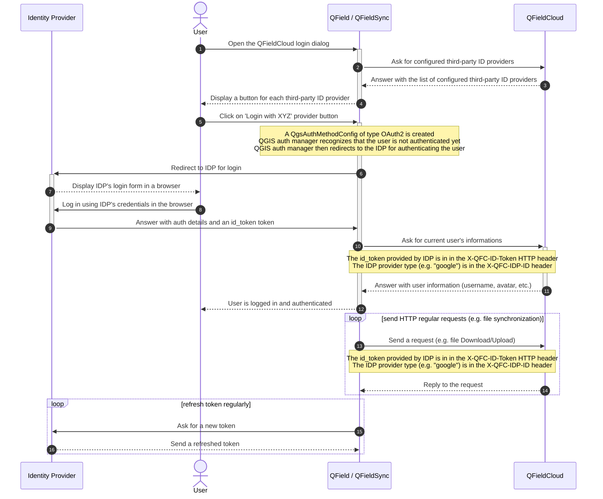

# Third-party authentication

QFieldCloud and QField / QFieldSync clients allow authentication using regular login and password, for a user that is already registered on QFieldCloud.

It is also possible to authenticate using a third-party identity provider (e.g. Google, [OpenID Connect](https://openid.net/developers/how-connect-works/)).

Here is a sequence diagram of how a third-party login happens in QFieldCloud (in the browser):

Here is a sequence diagram of how third-party authentication happens in QField and QFieldSync:

