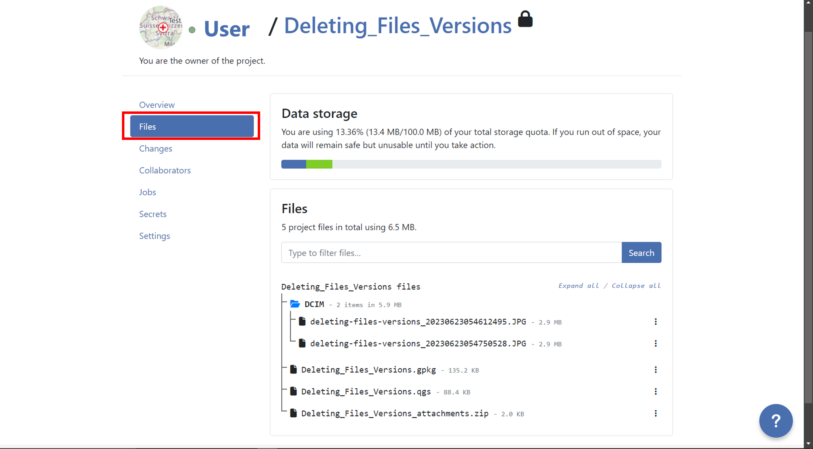
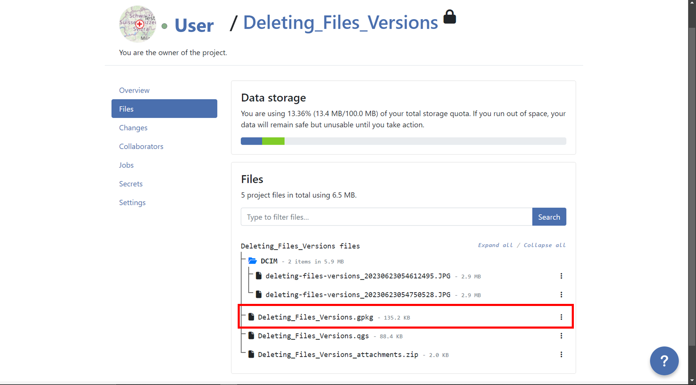
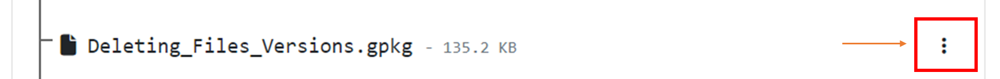
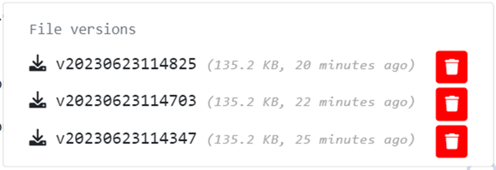
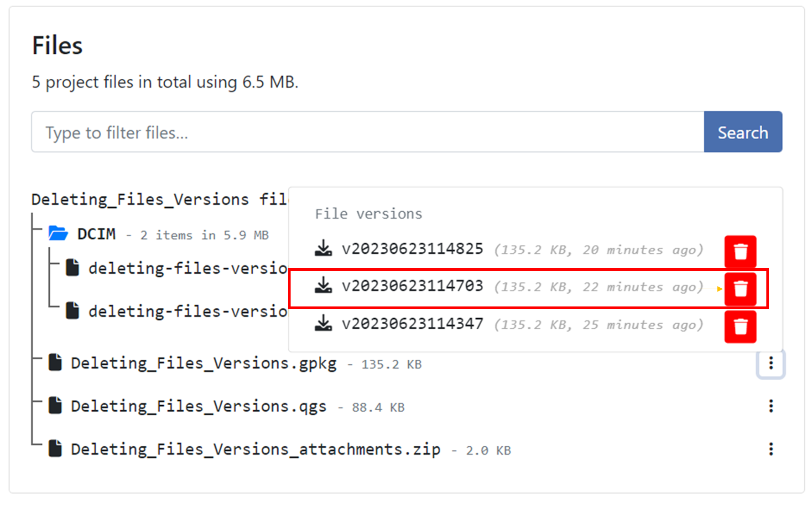
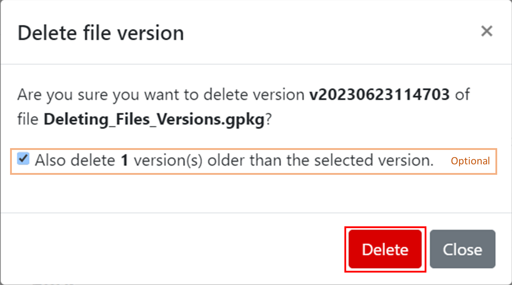
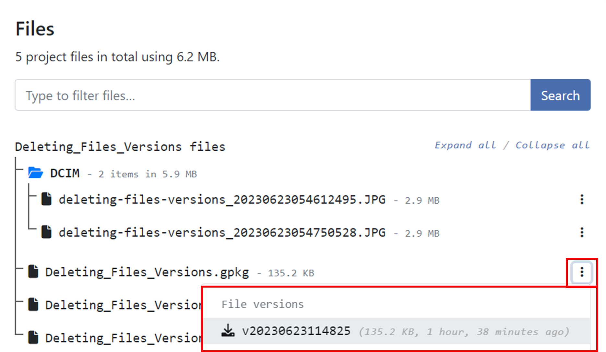

Projects are the main data containers on QFieldCloud. Users can create any number of projects. Projects must contain a single `.qgs`/`.qgz` QGIS file, and may in addition contain any combination of geospatial files -- GeoPackages, Shapefiles, TIFs -- or data files such as photos, PDFs etc. Files cannot be shared between projects.

QFieldCloud projects have a name and an owner. The owner of a project is a QFieldCloud user or an organization. No two projects can use the same pair <owner_name, project_name>.

Projects can be marked as either public or private. Private projects are accessible only to users added to a project as project collaborators. Public projects are visible to, and can be downloaded by, any QFieldCloud user.

## Creating a project

A project can be created in two different ways: either using the QFieldCloud web interface or using QFieldSync in QGIS.

## Files

Files are the skeleton on which QFieldCloud project works. To make a QFieldCloud project alive you need to upload at least a single QGIS project file in the `.qgs` or `.qgz` file formats. All geospatial files must be uploaded using the same relative paths as on your computer. If external SVG or raster symbology is used, you must to upload the corresponding files too.

!!! note
    QFieldCloud does not support projects stored in a GeoPackage (`.gpkg`) files (but you can still use GeoPackage files to store datasets for your project).

A typical file structure of a QGIS file might look something like this:
```
project
├── data
│   ├── basemap.tif
│   ├── bees.gpkg
│   └── fields.gpkg
├── symbology
│   ├── icon.svg
│   └── line-pattern.png
├── DCIM
│   ├── bees-20220404121212.jpg
│   ├── bees-20220405040506.jpg
│   └── fields-20220405040607.jpg
└── project.qgs
```

## File versions

QFieldCloud uses file versioning. This allows you to restore to a previous version of any modified file. Files and file versions can be found under the **Files** section of your project. Subscriptions plans allow a different number of versions per file. See the qfield.cloud [pricing page for further details](https://qfield.cloud/pricing.html).

### Deleting old file versions

To ensure that only relevant file versions are kept, and to reduce the amount of storage needed by your account, you can delete obsolete file versions. You can manually delete file versions from the project's **File** section.

To delete file versions in QFieldCloud, follow these steps:

1. Go to the "Files" section of your project.
2. Locate the layer for which you want to delete versions.
3. Click on the three dots next to the layer name.
4. You will see a list of versions for that specific layer.
5. Identify the version you want to delete and click on the red trash bin icon next to it.
6. Confirm the deletion when prompted, if you want to delete all versions before a specific version, you can do it activating the option "Also delete `n` version(s) older than the selected version.".
7. After deleting a pop up message will appear with the success and the list of versions will show just the versions that was not selected for deletion.

## Collaborators

A project collaborator is QFieldCloud user invited to contribute to a project. A single project may have multiple collaborators. Collaborators with roles **owner** or **admin** can add more users as collaborators. Projects owned by an organization allow adding **teams** as collaborators. Read more about [collaborator roles](permissions.md).

## Changes

Changes made on vector layers and uploaded to QFieldCloud from a QField device will appear here. A _change_ stores the difference between attributes or geometries before and after the upload.

Changes register which method was used for uploading; it can be one of:

- `create` - a new feature has been created.
- `delete` - an existing feature has been deleted.
- `patch` - an existing feature has been modified.

Features that have been created and later deleted without being pushed to QFieldCloud do not appear in project changes.

!!! note
    Changes to online vector layers (PostGIS, WFS) that do not have "Offline editing" cloud layer action do not generate a change, but instead modify the original data source _directly_.

!!! note
    Changes to vector layers done in QGIS will not appear here.

## Jobs

Read more about [project jobs](jobs.md).

## Secrets

Secrets are settings that are securely stored in encrypted way. Project jobs automatically have access to their secrets. Once added, a secret may be removed, but not edited.

There are two types of secrets:

- **Environment variables** - Environment variables will be available to QGIS while your project jobs are running.
- **pgservice connection** - A PostgreSQL/PostGIS connection as defined in the <code>.pg_service.conf</code> configuration file. If you use multiple service definitions, you should add multiple secrets for each of them.

## Settings

Project settings are available only to project owners and collaborators with elevated permissions (FIX ME: specify). _Settings_ should be handled carefully as users can modify sensitive project settings and perform unrecoverable actions.

- Change the project visibility to public.
- Change the project owner.
- Permanently delete a project.
- etc

!!! warning
    Actions issued from a project' settings page can lead to data loss!
