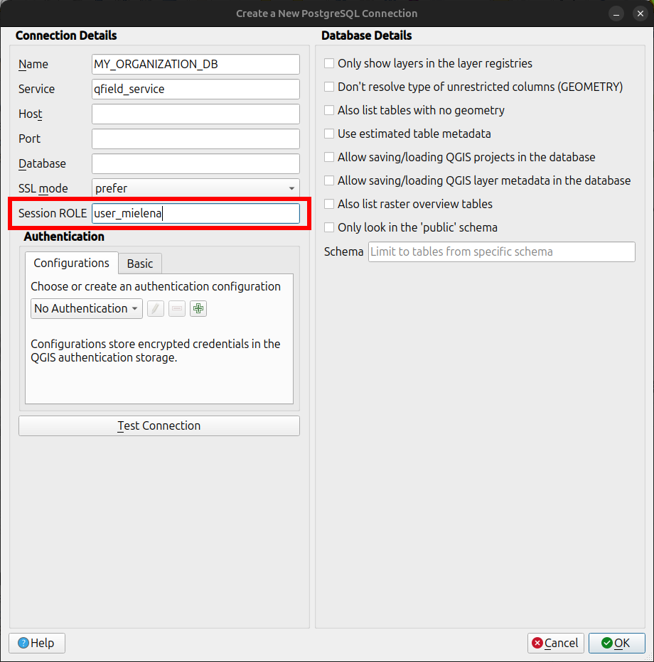
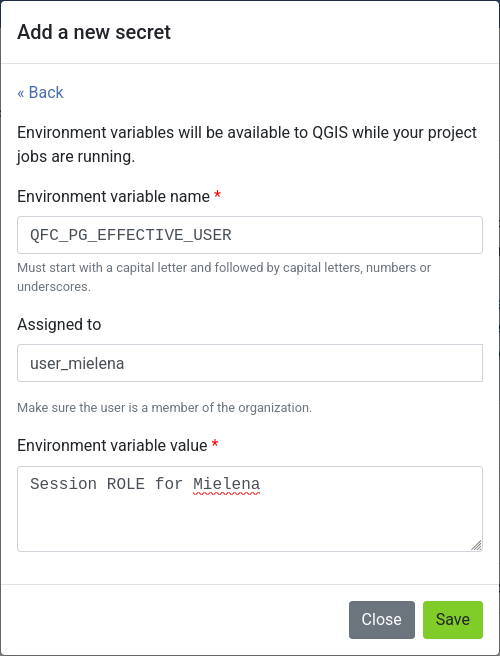

# Secrets

Secrets are project settings that are securely stored in an encrypted way.
Jobs will automatically have access to the project's secrets, allowing for secure connections to external services without exposing credentials in your project files.

## Types of Secrets

There are two types of secrets you can create in QFieldCloud:

- **Environment variables:** These will be available to QGIS as environment variables while your project jobs are running.
You need to provide a name (capitals only) and a value.

- **pg_service configurations:** This allows you to add a PostgreSQL/PostGIS connection as defined [in a `pg_service.conf` configuration file](https://www.postgresql.org/docs/current/libpq-pgservice.html).

!

!!! warning
    QFieldCloud makes sure your credentials are stored in a secured and encrypted manner.
    **We strongly advice to allocate users the least privileges in shared environments to prevent potential leakage.**
    Users who have the permission to upload files may  also have access to the corresponding credentials.

## Environment variable

Environment variables will be available to QGIS while your project jobs are running.

You need to fill in the environment variable name (capitals only) and the environment variable value as free text.

!

## Secrets and Precedence

To provide granular control over data access, secrets in QFieldCloud can be defined at three different hierarchical levels.
When a new job is initiated, QFieldCloud will access the secrets available and follow the following hierarchical order of precedence:

1. **User-Assigned Secret (Highest Precedence):** A secret defined within a project and assigned to a specific user.
This is the most specific level and overrides all others for that user.

2. **Project-Level Secret:** A general secret defined for a specific project.
It applies to all project members unless a user-assigned secret is present.

3. **Organization-Level Secret (Lowest Precedence):** A secret defined at the organization level.
It is used as a fallback for all projects within the organization that require it, provided no project or user-level secret has been set.

This hierarchical system allows an administrator to set a general, low-privilege database role at the organization level, while assigning more privileged roles for specific projects or trusted individual users.

### Secret Configuration

In order to add a new secret, you first need to decide what kind of secret is needed for your project.

#### Organization Level Secret

Navigate to your organization's settings and select the **Secrets** tab.
Secrets added here will be available to all projects within the organization unless overridden.

#### Project  Level Secret

Navigate to your project's settings and select the **Secrets** tab. Secrets added here will override any organization-level secrets with the same name.

#### User-Assigned Level

Within a project's **Secrets** tab, you can add a new secret and explicitly assign it to a specific project member.
This provides the highest level of precedence.

#### Adding a secret

To add a new secret to give access to your Postgres/PostGIS database, follow the same format as defined in the `pg_service.conf` configuration file.
This can either be done manually as plain text or through  the "Advanced editor".
The "Advanced editor" allows you to paste the `pg_service.conf` file contents directly.

You can add the following information:

- service name
- database name
- database user
- database password
- database host
- database port
- database SSL connection

For other service settings you can use the **Add extra pgservice field** button to add additional settings and their values.

If you use multiple service definitions, you should add multiple secrets for each of them.

!!! note
    Once added, a secret can only be removed, but cannot be edited.

!!! note
    QFieldCloud secrets are available only during project's job runs, which allows you to configure your PostgreSQL layers as "Offline editing".
    You **cannot** use QFieldCloud secrets to distribute `pg_service.conf` files across devices.
    For security reasons, you have to do this manually. You can read [how to configuring QField to use a `pg_service.conf`](../../how-to/project-setup/pg-service.md) file.

!

The "Advanced editor" allows you to directly edit the settings as plain text.
This is convenient in cases you want to copy and paste your settings directly from your `pg_service.conf` file.

!

### Overriding PostgreSQL Session Role

In order to override the connecting PostgreSQL user during packaging and delta applying Jobs, you need to **create a specific Environment Variable Secret** called `QFC_PG_EFFECTIVE_USER`.

This Secret will make QFieldCloud behave the same way as when you set a `Session ROLE` value, in a PostgreSQL/PostGIS connection setting in QGIS.

In QGIS, the **Session ROLE** setting allows you to separate **authentication** (logging in) from **authorization** (permissions and identity).
This utilizes the PostgreSQL `SET ROLE` command.

!

**Use Case: Simplified User Management & Auditing**

Imagine in the organization with field workers. Managing many unique passwords and updating them in QFieldCloud Secrets is inefficient. Instead, you can use a **Proxy Authentication** approach:

1. **Generic Connection User:** You create one database role (e.g., `qfield_service`) that handles the actual password/SSL connection.
2. **Specific User Roles:** You create roles for your actual users (e.g., `user_mielena`, `ninja_user_001`) without passwords.
3. **Grant Permissions:** You allow the service to "become" the users:

```sql
GRANT user_mielena TO qfield_service;
```

**QGIS Configuration:** In the QGIS Connection setup, you connect as `qfield_service`, but in the "Session role" field, you enter `user_mielena`.

**The Result:**

- **Auditing:** When data is synced, database triggers utilizing `current_user` will record `user_mielena` as the author, rather than the generic service account.
- **Security:** If you use PostgreSQL **Row-Level Security (RLS)** to restrict users to specific regions, the database will apply rules based on `user_mielena`, ensuring that only downloads or edits her assigned area for this user.

To configure this:

1. Create a new secret with the type **Environment variable**.
2. Name the secret `QFC_PG_EFFECTIVE_USER` (the name must be exact).
3. Set the value to the desired role name.

!

!!! important
     This secret must be explicitly assigned to a **User**, within a Project or an Organization.

### Example

The following example will go through the addition and verification process of the above explained hierarchy.
You can add additional attributes to your table to check and confirm that only users with the according roles have the ability to add new features.

### Part 1: PostgreSQL Database Configuration

First, the database needs to be configured and the user roles defined.
Following an automated trigger needs to be added, to populate the allocated user column inside the database.

#### 1. Database and Extension Instantiation

Start with creating a new database and enable the necessary `postgis` and `uuid-ossp` extensions.

```sql
-- Create a new database with a specified name, owner, and encoding.
CREATE DATABASE db-og-secrets OWNER qfield ENCODING 'UTF8';

-- Connect to the newly created database.
\c db-og-secrets

-- Install the required extensions if they do not already exist.
CREATE EXTENSION IF NOT EXISTS postgis;
CREATE EXTENSION IF NOT EXISTS "uuid-ossp";
```

#### 2. Establishment of Roles

Create three distinct user roles to simulate the tiered permission structure that QFieldCloud secrets will manage.

```sql
-- Create three roles, each with login privileges and an assigned password.
CREATE ROLE ninja_org LOGIN PASSWORD 'your_strong_password_for_org';
CREATE ROLE ninja_project LOGIN PASSWORD 'your_strong_password_for_project';
CREATE ROLE ninja_user LOGIN PASSWORD 'strong_password_for_user_001';
```

#### 3. Schema and Table Definition

Create a schema and a table for point geometries.
The table will include a `pg_user` field to automatically record which role was responsible for the data insertion.

```sql
-- Create a schema named 'ninja' if it does not already exist.
CREATE SCHEMA IF NOT EXISTS ninja;

-- Create a table within the 'ninja' schema with the specified columns.
CREATE TABLE IF NOT EXISTS ninja.ninja_point (
  id UUID PRIMARY KEY DEFAULT uuid_generate_v4(),
  pg_user TEXT,
  some_value TEXT NOT NULL,
  geom GEOMETRY(POINT, 4326)
);
```

#### 4. Implementation of an Automated User-Attribution Trigger

This trigger automatically populates the `pg_user` field with the identifier of the `current_user` whenever a record is inserted or updated.

```sql
-- Define a trigger function to update the pg_user field.
BEGIN;
SET LOCAL SEARCH_PATH TO ninja, public;

CREATE OR REPLACE FUNCTION update_pg_user() RETURNS TRIGGER AS $$
BEGIN
  NEW.pg_user := current_user;
  RETURN NEW;
END;
$$ LANGUAGE plpgsql SET search_path FROM CURRENT;

COMMIT;
```

And assign the trigger to the ninja_point table for INSERT or UPDATE events.

```sql
BEGIN;
SET LOCAL SEARCH_PATH TO ninja, public;

DROP TRIGGER IF EXISTS trg_ninja_point_update_pg_user ON ninja.ninja_point;

CREATE TRIGGER trg_ninja_point_update_pg_user
  BEFORE INSERT OR UPDATE ON ninja_point
  FOR EACH ROW EXECUTE FUNCTION update_pg_user();

COMMIT;
```

#### 5. Permission Granting

To ensure security and proper data access, grant each role only the permissions required for its function.
This approach follows the principle of least privilege.

First, all roles need USAGE permission on the ninja schema to access any tables within it.

```sql
GRANT USAGE ON SCHEMA ninja TO ninja_org, ninja_project, ninja_user;
```

##### Role-Based Access

- **`ninja_user` (Read-Only)**: This role is for general users who only need to view data.

  - Grants: `SELECT`

- **`ninja_project` (Read/Write)**: This role is for project members who need to view, add, and modify data.

  - Grants: `SELECT`, `INSERT`, `UPDATE`

- **`ninja_org` (Admin)**: This role is for organization owners who require full control over the data, including deleting records and managing foreign key relationships.

  - Grants: `SELECT`, `INSERT`, `UPDATE`, `DELETE`, `REFERENCES`

```sql
-- Grant table permissions based on role responsibilities

-- Read-only access for general users
GRANT SELECT ON TABLE ninja.ninja_point TO ninja_user;

-- Read and write access for project members
GRANT SELECT, INSERT, UPDATE ON TABLE ninja.ninja_point TO ninja_project;

-- Full administrative access for organization owners
GRANT ALL PRIVILEGES ON TABLE ninja.ninja_point TO ninja_org;
```

### Part 2: QFieldCloud and QGIS Project Configuration

Direct to QFieldCloud to set the secrets at different levels in QFieldCloud.

#### Scenario 1: Organization-Level Secret Application

1. **Secret Addition:** Navigate to the settings page of your organization and select the **Secrets**  from there.
Add a new `pg_service` secret using the credentials for the **`ninja_org`** role.

2. **Verification:** To ensure that the secret is set at the right level, you can now create a new feature in the `ninja_point` layer inside QField.
Once synchronized with QFieldCloud, the `pg_user` attribute for the new feature is expected to be **`ninja_org`**.

#### Scenario 2: Project-Level Secret Application (Precedence over Organization)

1. **Secret Addition:** Navigate to the settings page of your project and select the **Secrets**  from there.
Add a new `pg_service` secret with the same service name as previous, but this time use the credentials for the **`ninja_project`** role.

2. **Verification:** To ensure that the secret is set at the right level, you can create a new feature in the `ninja_point` layer inside QField.
Once synchronized with QFieldCloud, the `pg_user` attribute for the new feature is expected to be **`ninja_project`**
This demonstrates that the project-level secret correctly superseeds the organization-level secret.

#### Scenario 3: User-Level Secret Application (Highest Precedence)

1. **Secret Creation:** Navigate to the settings page of your project and select the **Secrets** tab.
Add a new `pg_service` secret.
Use the credentials for the **`ninja_user`** role and explicitly assign this secret to your user account.

2. **Verification:** Create a new feature in QField.
The `pg_user` attribute for this feature is expected to be **`ninja_user`**, confirming that the user-assigned secret holds the highest level of precedence in the hierarchy.
