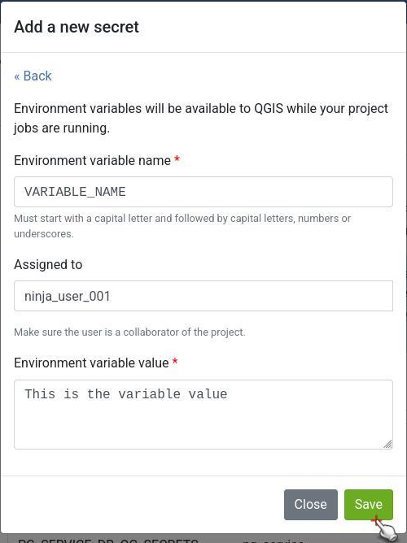
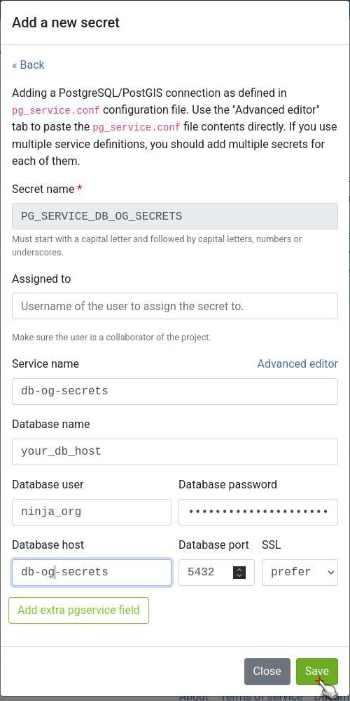
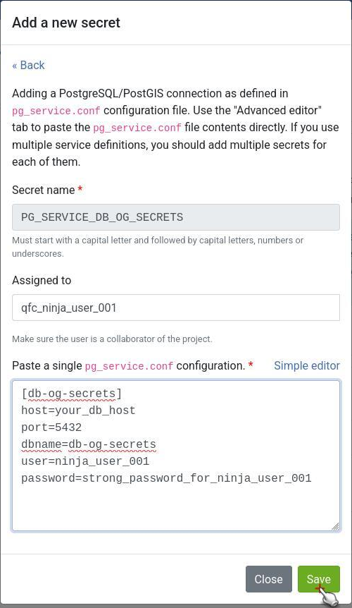

# Secrets

Secrets are settings that are securely stored in an encrypted way. Project's jobs will automatically have access to their secrets. There are two types of secrets in QFieldCloud:

- **environment variables** - Environment variables will be available to QGIS while your project jobs are running.
- **pg_service configurations** - Adding a PostgreSQL/PostGIS connection as defined in the `pg_service.conf` configuration file.

!!! note
    Once added, a secret can only be removed, but cannot be edited.

!!! warning
    QFieldCloud makes sure your credentials are stored in a secured and encrypted manner. Nevertheless, we advice our users to use roles with the least privileges in shared environments to prevent potential leakage.
    Also note all users with upload file permissions can potentially access the values of those credentials too.

## Adding a new secret

Adding a new secret on QFieldCloud is an easy process of only three steps.

1. Navigating to the project' secrets page.
2. Pressing **Add a new secret** button and choosing the type of secret you want to add.
3. Storing the secret contents.

!

## Environment variable

Environment variables will be available to QGIS while your project jobs are running.

You need to fill in the environment variable name (capitals only) and the environment variable value as free text.

!

## pg_service configuration

Adding a PostgreSQL/PostGIS connection as defined in `pg_service.conf` configuration file. The "Advanced editor" allows to paste the `pg_service.conf` file contents directly. If you use multiple service definitions, you should add multiple secrets for each of them.

!!! note
    QFieldCloud secrets are available only during project's job runs, which allows you to configure your PostgreSQL layers as "Offline editing". You **cannot** use QFieldCloud secrets to distribute `pg_service.conf` files across devices. For security reasons, you have to do this manually. You can read [how to configuring QField to use a `pg_service.conf`](../../how-to/pg-service.md) file.

To add a PostgreSQL service you can use either the simple visual editor, or directly edit the service configuration as plain text.

- service name
- database name
- database user
- database password
- database host
- database port
- database SSL connection

For other service settings you can use the **Add extra pgservice field** button to add pairs of settings and their values. Alternatively, you can edit the service configuration directly as plain text.

!

The advanced configuration allows you to directly edit the settings as plain text. This is convenient in cases you want to copy and paste your settings directly from a `pg_service.conf` file.

!
