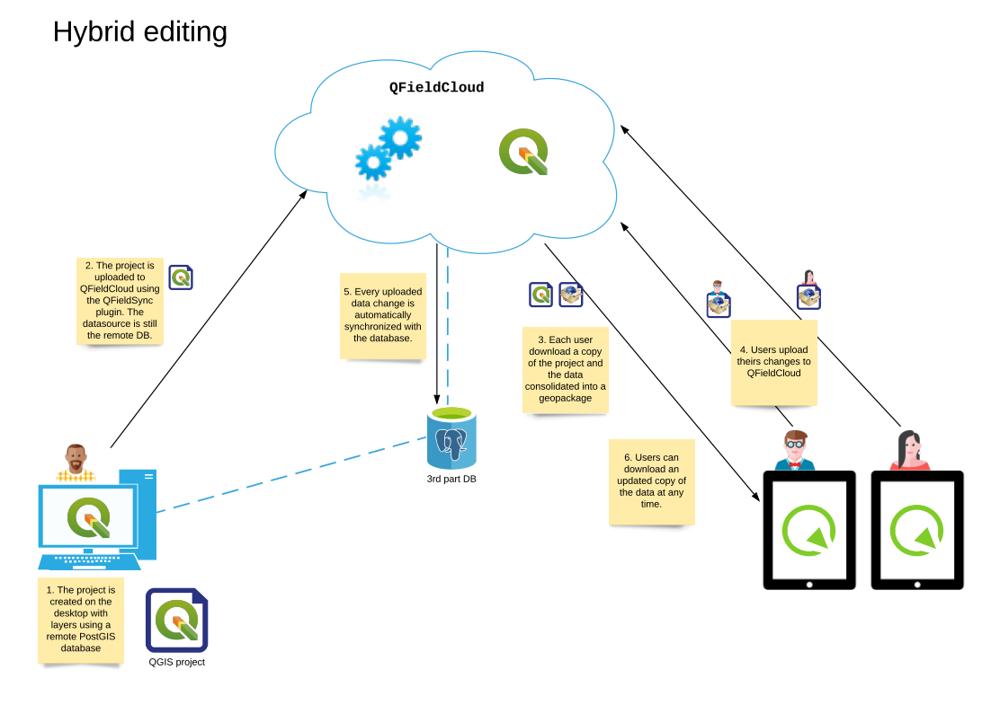

# QFieldCloud System Documentation

The aim of this document is to provide an overview of the QFieldCloud system to understand the underlaying logic and technology.

## Entities and Concepts

### QGIS Project

In the QFieldCloud context, a project refers to all data files that are required for a properly functioning QGIS project.
Read more about [QGIS projects](./projects.md).

### Layer action

Each layer in the QGIS project can be configured with a "layer action".
The action determines how QFieldSync and QField should treat the layer.

There are the two actions that can be configured: cloud action and cable action.
They work in the QFieldCloud and traditional cable export context respectively.

The following actions are available and will be explained in more detail below:

| Name showed in the UI           | Work mode     | Spatial type |
|---------------------------------|---------------|--------------|
| Offline editing                 | cloud & cable | Vector       |
| Directly access data source     | cloud & cable | Any          |
| Remove from project             | cloud & cable | Any          |
| Copy                            | cable         | Any          |
| Keep existing (Copy if missing) | cable         | Vector       |

#### Cloud action configuration

The cloud action set in QFieldSync is applied by QFieldCloud only at the moment of packaging a project for QField.

This is the behavior of QFieldCloud (`libqfieldsync`) with the layers:

| Action                      | File based layer                                                                               | Service-based layer (e.g. WMS)    | Database layers (Postgres)                                                                       |
|-----------------------------|------------------------------------------------------------------------------------------------|-----------------------------------|--------------------------------------------------------------------------------------------------|
| Offline editing             | Create consolidated copy of the data on pull, apply delta file on push to original data source | N/A                               | Create a consolidated copy of the data on pull, apply delta file on push to original data source |
| Directly access data source | Create a read-only copy in an individual GeoPackage                                            | No action on the layer            | No action on the layer                                                                           |
| Remove from project         | Remove the layer from the project                                                              | Remove the layer from the project | Remove the layer from the project                                                                |

In summary, with QFieldCloud:

- *Offline editing* means that a offline copy of the data will be generated by QFieldCloud and downloaded to QField.
The data from *Offline editing*-layers will all be stored as multiple layers within a single `data.gpkg`.
Whenever a modification is made on QField, a JSON structure called a *Change* (or Delta) will be generated only for the features that have been modified, only for the attributes or the geometry that have been modified.
On push, the original data source will be updated, including the database for database layers.
- *Directly access data source* is mainly used for service-based layers that are located on a internet accessible server.
The data in these layers are directly modified by QField.
Examples are WFS, WM(T)S-layers or layers coming from a database such as PostGIS layers.
If the layer is file-based it will be in read-only mode.
- *Remove from project* will simply remove the layer from the project (not package it for QField).

With QFieldSync in QGIS it will be possible to update a project already loaded on QFieldCloud.

In the event that the changes concern only styles, forms etc. but not the data or the structure of the layers, the QGIS project file (`.qgs`/`.qgz`) on the server will simply be updated.

If there are changes in the data or the structure of the layers, then the new data source files will be updated.

Note that changing the structure (or schema) of the layers such as adding, removing or renaming attributes, changing not null constraints, etc. might have effects.
If such changes are pushed to QFieldCloud, please make sure all QField users have pushed their changes in advance.
Otherwise it might be impossible for QFieldCloud to apply these Changes/Deltas from older version of the QGIS project.

#### Behaviour of QField

Depending on the actions set for each layer in QFieldSync for QFieldCloud or Cable export, QField will act as follows:

| Action                          | File based layer          | Service-based layer (e.g. WMS, database)   | Notes                                |
|---------------------------------|---------------------------|--------------------------------------------|--------------------------------------|
| Offline editing                 | Create and push a Change  | N/A                                        |                                      |
| Directly access data source     | Layer is readonly         | Edit the online  database                  |                                      |
| Remove from project             | N/A                       | N/A                                        | the layer is not available on QField |
| Copy                            | Create and readonly       | N/A                                        |                                      |
| Keep existing (Copy if missing) | Create and readonly       | N/A                                        |                                      |

### Technical names for actions

The technical names for the available actions in QFieldSync are:

| Name showed in the UI           | Action internal name |
|---------------------------------|----------------------|
| Offline editing                 | OFFLINE              |
| Directly access data source     | NO_ACTION            |
| Remove from project             | REMOVE               |
| Copy                            | COPY                 |
| Keep existing (Copy if missing) | KEEP_EXISTING        |

## Use Cases

### Offline editing in the field, QFieldCloud connected to the database
Hybrid editing mode with synchronization on the server

!

### Offline editing in the field, QFieldCloud not connected to the database
Offline editing mode with desktop synchronization

!
