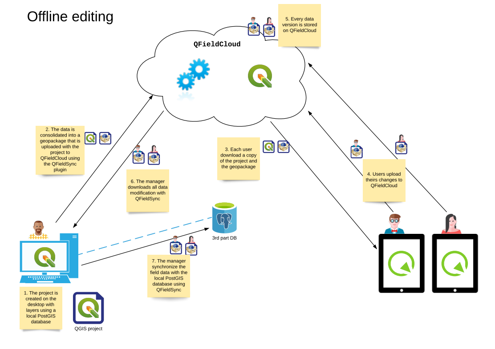

# QFieldCloud System Documentation
  The aim of this document is to provide an overview of the QFieldCloud system to
  understand the underlaying logic and technology.

## Entities and Concepts

### QGIS Project
A QGIS project is a *.qgs* or *.qgz* file. A Project is created on
QGIS Desktop and uploaded to QFieldCloud using the QGIS's plugin
QFieldSync. Before the uploading of the QGIS project, it is necessary
for each layer of the QGIS project to set an "action" that determines how
QFieldSync and QField should treat the layer. There are the two types
of actions that can be setup - one for QFieldCloud and one for the
traditional cable export.

This information is saved within the QGS project as layer's
*customProperty*, with the *QFieldSync/action* key.

The following actions are available and will be explained in more detail below:

| Name showed in the UI           | Work mode           |
|---------------------------------|---------------------|
| Offline editing                 | QFieldCloud & cable |
| Directly access data source     | QFieldCloud & cable |
| Remove from project             | QFieldCloud & cable |
| Copy                            | only cable          |
| Keep existing (Copy if missing) | only cable          |

#### QFieldSync > QFieldCloud configuration
When synchronising a project with QFieldCloud, all layers in the QGIS project are sent to QFieldCloud. The configuration set in QFieldSync is applied by QFieldCloud only at the moment of packaging a project for QField. 

This is the behavior of QFieldCloud (`libqfieldsync`) with the layers:

| Action                      | File based layer                                                                               | Service-based layer (e.g. WMS)    | Database layers (Postgres)                                                                       |
|-----------------------------|------------------------------------------------------------------------------------------------|-----------------------------------|--------------------------------------------------------------------------------------------------|
| Offline editing             | Create consolidated copy of the data on pull, apply delta file on push to original data source | N/A                               | Create a consolidated copy of the data on pull, apply delta file on push to original data source |
| Directly access data source | Create a read-only copy in an individual geopackage                                            | No action on the layer            | No action on the layer                                                                           |
| Remove from project         | Remove the layer from the project                                                              | Remove the layer from the project | Remove the layer from the project                                                                |

In summary, with QFieldCloud:

- *Offline editing* means that a geopackage will be generated on the
  server (or directly on the desktop for file-based layers) and
  downloaded by clients. *Offline editing*-layers will all be combined in a single `data.gpkg`.
  The client will generate deltafiles of the changes. On push, the original data source will be updated, including the database for database layers. 
- *Directly access data source* is mainly used for service-based layers that are located on a server
  accessible via the Internet and that are modified directly by QField.
  Examples are WMS, WMTS-layers or layers coming from a database.
  If the layer is file-based, a read-only copy will be generated in an individual geopackage per layer.
- *Remove from project* will simply remove the layer from the project (not package it for QField).

From QFieldSync it will be possible to update a project already
loaded on QFieldCloud. In the event that the changes concern only
styles, forms etc. but not the structure of the layers, the
project on the server will simply be updated.
If there are changes in the layers structure, the project will be
reset on the server (delta files will be deleted) and for each
client it will be necessary to download the updated version of the
project before being able to push new changes.

#### QFieldSync > Cable export configuration
When using the traditional cable export, the configuration in QFieldSync > Cable export will be applied by QFieldSync at the moment of clicking on "Package for QField".
This is the behavior of QFieldSync for cable export with the different
layer actions:

| Action                          | File based layer                                                 | Web-service layers (e.g. WMS)     | Database layers (Postgres)                     |
|---------------------------------|------------------------------------------------------------------|-----------------------------------|------------------------------------------------|
| Offline editing                 | Create a consolidated copy of the data                           | N/A                               | Create a consolidated copy of the data (.gpkg) |
| Directly access data source     | N/A                                                              | Directly access the web service   | Edit the online (live) database                |
| Remove from project             | Remove the layer from the project                                | Remove the layer from the project | Remove the layer from the project              |
| Copy                            | Make source path relative and copy the file                      | N/A                               | N/A                                            |
| Keep existing (Copy if missing) | Make source path relative and copy the file if it does not exist | N/A                               | N/A                                            |

#### Behaviour of QField
Depending on the actions set for each layer in QFieldSync for QFieldCloud or Cable export, QField will act as follows:

| Action                          | File based layer                   | Service-based layer (e.g. WMS, database)   |
|---------------------------------|------------------------------------|--------------------------------------------|
| Offline editing                 | Create and push deltafile          | N/A (it's always file based at this point) |
| Directly access data source     | N/A                                | Edit the online (live) database            |
| Remove from project             | N/A (the layer is no longer there) | N/A (the layer is no longer there)         |
| Copy                            | Create and push deltafile          | N/A                                        |
| Keep existing (Copy if missing) | Create and push deltafile          | N/A                                        |

### QFieldCloud Project
    Is composed of one and only one QGIS project and the possible
    related files (e.g. geopackages, images, ...).  

### Technical names for actions
The technical names for the available actions in QFieldSync are:

| Name showed in the UI           | Action internal name |
|---------------------------------|----------------------|
| Offline editing                 | OFFLINE              |
| Directly access data source     | NO_ACTION            |
| Remove from project             | REMOVE               |
| Copy                            | COPY                 |
| Keep existing (Copy if missing) | KEEP_EXISTING        |

## Use Cases

### Offline editing in the field, QFieldCloud connected to the database
Hybrid editing mode with synchronization on the server

!

### Offline editing in the field, QFieldCloud not connected to the database 
Offline editing mode with desktop synchronization

!
