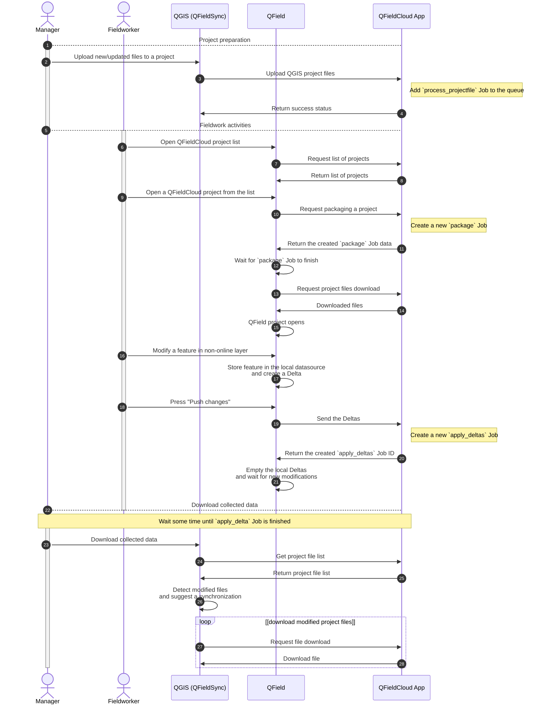

# Workflow

Here you can find a typical setup of a Manager and Fieldworker as two main actors who interact on QGIS and QField respectively.

```mermaid
sequenceDiagram
  autonumber

  actor Manager;
  actor Fieldworker;

  participant QGIS as QGIS (QFieldSync)
  participant QField
  participant API as QFieldCloud App

  Manager-->API: Project preparation
  activate Manager

  Manager->>QGIS: Upload new/updated files to a project
  QGIS->>API: Upload QGIS project files
  note right of API: Add `process_projectfile` Job to the queue
  API->>QGIS: Return success status

  Manager-->API: Fieldwork activities
  deactivate Manager
  activate Fieldworker

  Fieldworker->>QField: Open QFieldCloud project list

  QField->>API: Request list of projects
  API->>QField: Return list of projects
  Fieldworker->>QField: Open a QFieldCloud project from the list
  QField->>API: Request packaging a project
  note right of API: Create a new `package` Job
  API->>QField: Return the created `package` Job data

  QField->>QField: Wait for `package` Job to finish

  QField->>API: Request project files download
  API->>QField: Downloaded files

  QField->>QField: QField project opens

  Fieldworker->>QField: Modify a feature in non-online layer
  QField->>QField: Store feature in the local datasource <br> and create a Delta

  Fieldworker->>QField: Press "Push changes"
  QField->>API: Send the Deltas
  note right of API: Create a new `apply_deltas` Job
  API->>QField: Return the created `apply_deltas` Job ID
  QField->>QField: Empty the local Deltas <br> and wait for new modifications

  Manager-->API: Download collected data
  deactivate Fieldworker
  activate Manager
  note over Manager, API: Wait some time until `apply_delta` Job is finished

  Manager->>QGIS: Download collected data
  QGIS->>API: Get project file list
  API->>QGIS: Return project file list

  QGIS->>QGIS: Detect modified files <br> and suggest a synchronization

  loop [download modified project files]
    QGIS->>API: Request file download
    API->>QGIS: Download file
  end
  deactivate Manager


```
