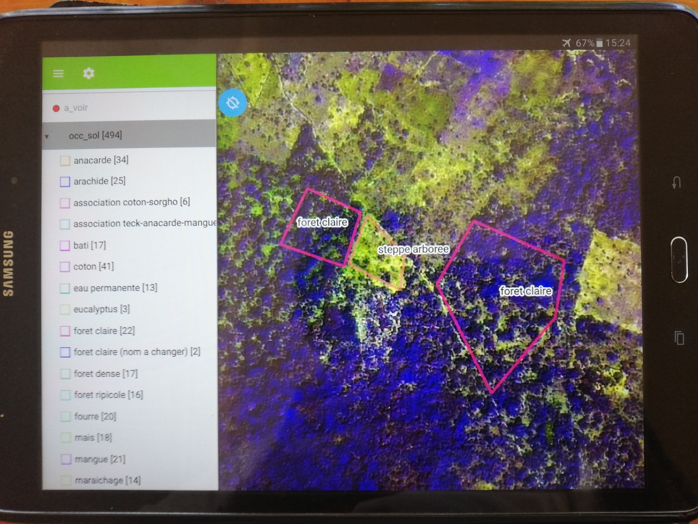
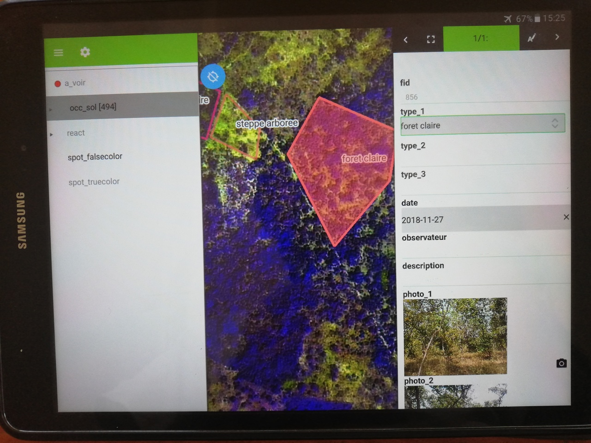
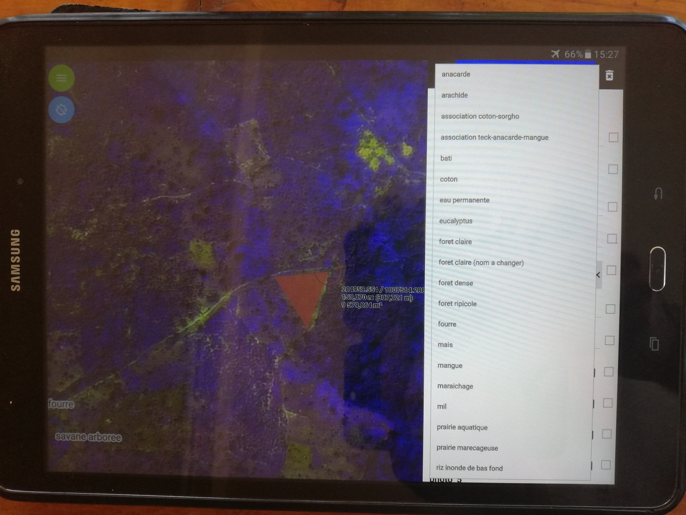
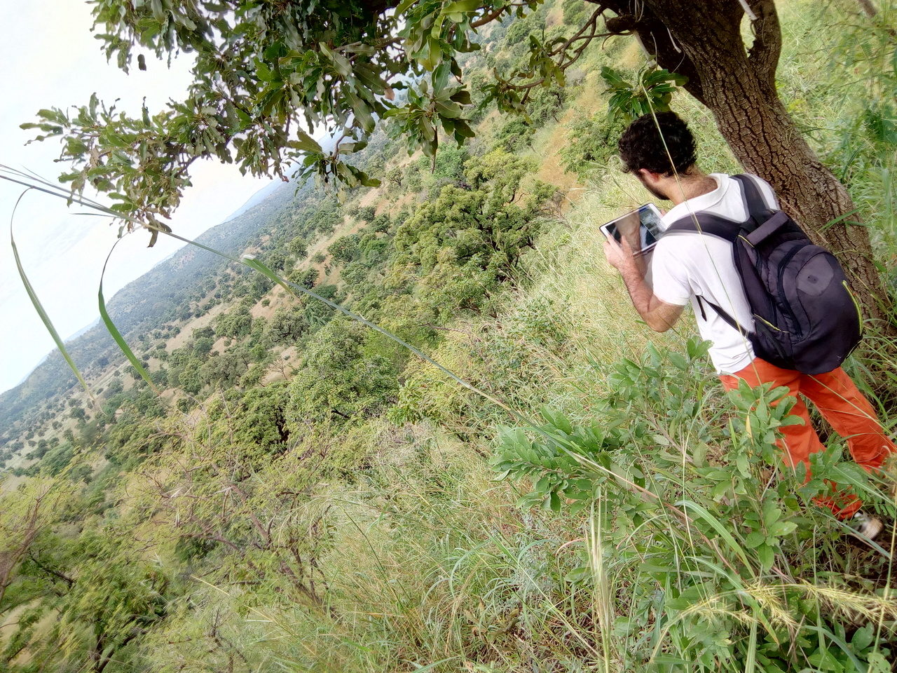

# Use of Qfield in the context of ground-truth data collection work of malaria transmitting mosquitoes

By Paul Taconet, GIS Engineer, French Research Institute for Sustainable
Development (IRD) 11.12.2018

## Goal and field constraints

For a research work aiming at improving the knowledge on the environment
of the mosquitoes that transmit malaria, the French Research Institute
for Sustainable Development needed to generate a land cover map of two
rural areas in Africa, one in Burkina Faso and one in Ivory Coast. Two
satellites images (Spot 6 at 1.5 meters spatial resolutions) are used as
input of a supervised object-based image classification for this work.
The supervised method implies the collection of ground truth parcels,
i.e. location and geo-referencing of a set of parcels of each land cover
class on the ground, preferably spread all over the study areas. Both
areas are 50 km2 wide and their nature (savannahs and rural areas, where
roads are mainly narrow clay tracks) imply to move around in motorbike
or by feet. In addition, one could quickly get lost in the rural
labyrinth tracks in absence of a map. We hence needed light and very
portable equipment, as well as a way to easily explore the area without
getting lost.

## Project preparation

We created a QGIS project with the Spot image and a layer to collect the
ground data.
We first converted our Spot image to a GeoPackage raster, and built pyramids so as to get quick rendering in QField.
The whole image (50 km2 at 1.5 m spatial resolution with 3 bands) weighted
approximately 800 MB, which enabled us to load it in our tablet without
the need to add any extra memory.

We created a vector layer to draw our ground truth parcels (i.e.
polygons of land cover parcels). It contained a field to identify the
land cover type, some fields to take pictures and a field for eventual
additional notes.

We then uploaded the project in QField in our tablet.

## Field work

On the field, we were able to move around easily in motorbike without
getting lost, thanks to our location displayed on QField with the
satellite image as background. When a parcel of interest was identified,
we were able to draw its perimeter in QField and very easily fill-in the
proper information on the attribute table (land cover type, pictures).
When hesitating on the land cover type to attribute to a given parcel,
we were able, in "live" (i.e. on the ground), to quickly look at
previously retrieved parcels and compare them to the parcel of interest
(with the pictures and the satellite image).

We were able, without any extra effort at the end each field working
day, to see the progress of the work: which pieces of our study area we
had covered, which remained to explore, how many parcels we had got for
each land cover class and how many remained to retrieve. This is very
appreciable in such conditions, where work can be testing and nights can
be shorts. Back in office, we did not have to realize fastidious and
time-consuming work such as digitalizing the parcels from a traditional
GPS point layer, linking the pictures to our land cover layer, etc.,
which traditionally took days of work.

!

!

!

!
