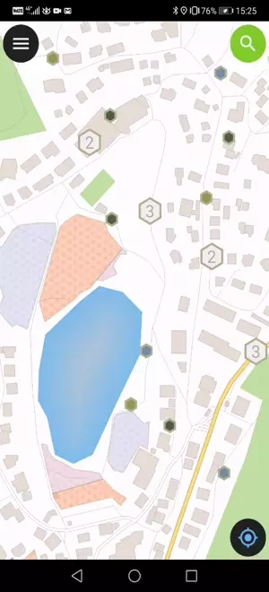
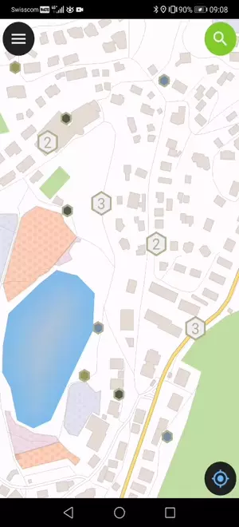

# Interact with the map

## Map legend

Open the **Main menu** and expend the layers list to display the legend
of the map.

!

## Turning on and off layers

`Main menu --> long press on the layer --> check or uncheck show on map canvas`

!

## Identify features

Tap on a feature on the map to identify it. If several features are
located where you tapped (either because there are multiple features
really close one to another, or because several layers are overlapping),
they will all be listed in the menu that opens on the right of the
screen.

!

Tap on one of the listed feature to access its attributes.

1.  Tap the **arrows** to scroll through all the identified features.
2.  Tap the **centre button** to center the map on the selected feature.
3.  Tap the **edit button** to edit the attributes of the selected
    feature.
4.  Scroll through the **sub-menus** to access all the attributes.

### Exceptions to identified layers

Often it is not required to be able to query every layer. Some layers
are only present as basemap and their attributes are not of interest.

You can manage this layerlist in QGIS desktop in
`Project --> Project Properties --> Identify Layers` and uncheck the base layers.

## Measure tool

Open the **Main menu** --> tap the settings button --> Measure Tool

