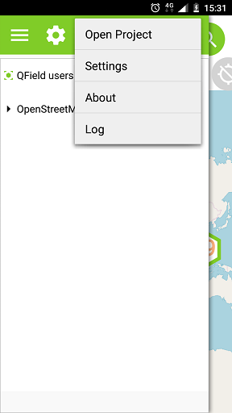
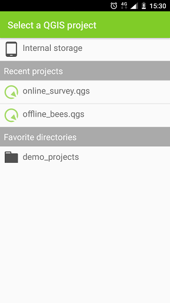

# Open a project

To open a project, tap on **Menu button --> Option button --> Open
Project**.

Select the project you want to open by navigating to it, or use the
**Recent projects** and **Favorites directories** shortcuts.

!

!

## Favorite directories

In the first screen of the file selector, there is a section showing the
favorite directories. To add a directory to the favorites, long click in
the file selector on the directory name. To remove an entry from the
favorites, long click on the entry in the favorites list.

## Advanced project selection

QField opens QGIS projects in the ".qgs" or ".qgz" format.

QField uses a customized file selector to open the projects. On choosing
"Open project" from the QField menu, the file selector will be opened
showing the following locations:

-   The primary media/shared storage directory.
-   The application-specific directories on all shared/external storage
    devices where the application can place persistent files it owns if
    they are not already included in the primary storage directory.

Inside these directories, only subdirectories and files with the
".qgs" or ".qgz" extension are shown.

QField requires the project file to be physically on the device, so it
is not possible to use providers that work with remote files (e.g.
Google Drive). On the other hand you can use apps like
[syncthing](https://syncthing.net/) or
[nextcloud](https://nextcloud.com/) (or dropbox and probably many
others) that allow you tho physically sync the file to your device.

## External SD card

The file selector shows the root of the SD card labeled as \"read-only\"
and the application-specific directory separated from the rest of the SD
card, as it is the only directory for which the app has write access.
The directory is the following:

``` bash
/Android/data/ch.opengis.qfield/files
```

!!! note
    Technically, this is due to the fact that Android intents
    ACTION_OPEN_DOCUMENT and ACTION_OPEN_DOCUMENT_TREE, work and grant
    read-write access on the content of the returning URI, not on the real
    linked file. This limitation which makes sense for how Android is
    structured but currently it is unusable with QField as QField needs to
    access the real file with a real path.

!!! warning
    By storing data in this folder, you risk losing data. The
    application-specific directory
    `/Android/data/ch.opengis.qfield/` will be deleted by the
    system if you uninstall QField from your Android device. This is
    important if you keep the data in the External sd card.

### How to turn external SD card into internal storage

Starting from Android 6.0, you can use the SD card as internal storage
for your Android phone. A feature called Adoptable Storage allows the
Android OS to format an external storage media as a permanent internal
storage. The data on the adopted SD card is encrypted and it can't be
mounted on another device.

**Please be sure you start with an empty SD card. It needs to be empty
because when the card is converted to "Internal" storage, it will be
formatted (wiped).**

1.  Go to device "Settings", then select "Storage".
2.  Select your "SD Card", then tap the "three-dot menu" (top-right),
    now select "Settings" from in there.
3.  Now select "Format as internal", and then "Erase & Format".
4.  Your SD Card will now be formatted as internal storage.
5.  Reboot your phone.

If you don't reboot the phone, many things may not work correctly, so
make sure you do.

It might be possible that the Adoptable Storage feature is not present
on your device even if it is running Android 6.0 and above. The device
manufacturer may have disabled the feature. However, command-line
methods exist which allow you to force a device to adopt a storage.
