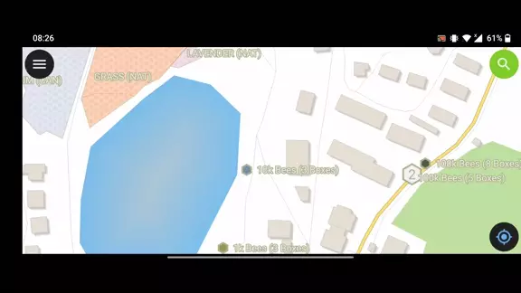

Search
======
Tap on the **Search button** on the top-right corner to search in the layers. 

1. Tap on the **name** in the result to pan the map on the feature (the feature will be highlighted in yellow).
2. Tap on the **attributes button** to open its attributes.

GoTo Coordinate
---------------
It is possible to go to Coordinates with the search tool. 

Tap on the **Coordinates** in the result to go to the Coordinates.
It is always possible to search WGS84 coordinates or current map CRS.

.. image:: ../images/goto_search.webp